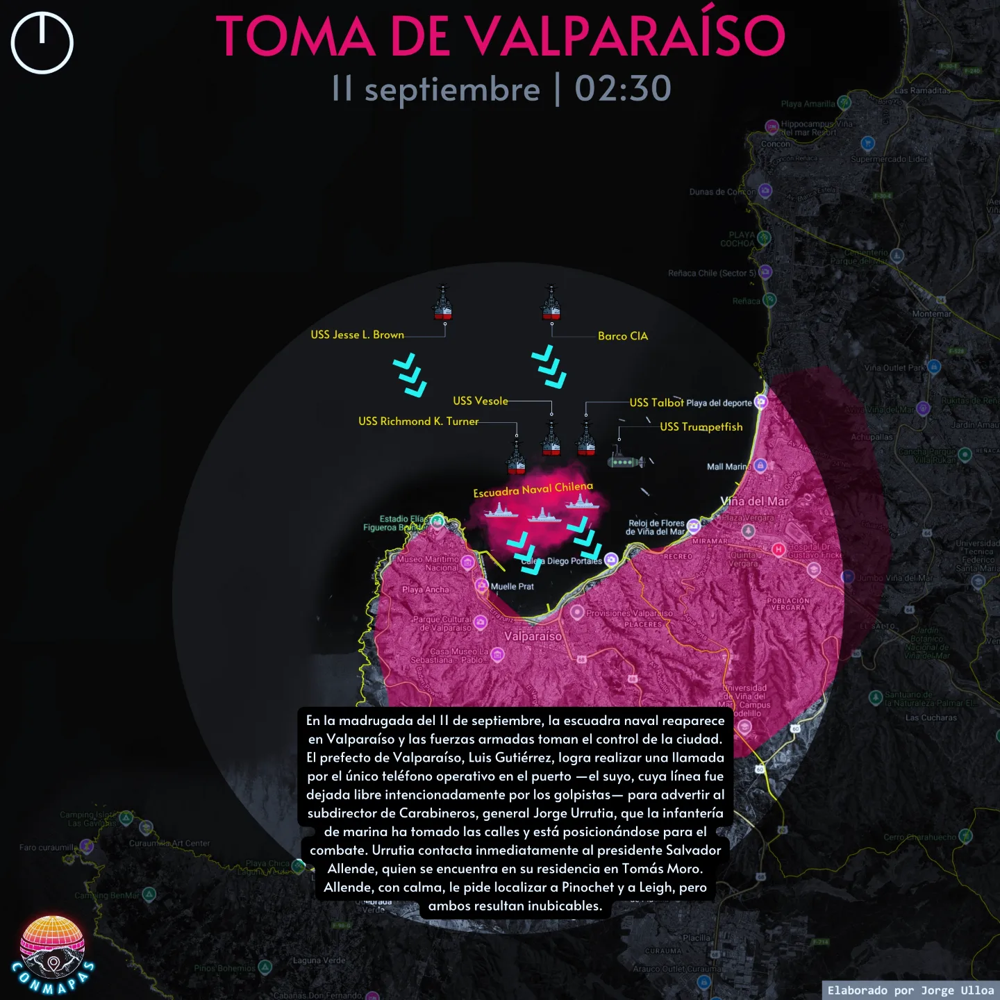

# 11 de septiembre de 1973 — Relato hora a hora

> Storytelling web, hora a hora, del golpe de Estado en Chile. Construido a partir
> de los mapas y relatos de **ConMapas** ([@conmapas](https://www.instagram.com/conmapas/)).
>
> **Sitio en vivo:** https://geoidegeoidal.github.io/storytelling-11s/



---

## ¿Qué es?

Un recorrido **hora a hora** por la jornada del 11 de septiembre de 1973: desde la
escuadra que reaparece en Valparaíso en la madrugada y los Hawker Hunter que
despegan hacia Santiago, hasta el último discurso de Salvador Allende, el
bombardeo a La Moneda, el Estadio Nacional y los días que siguieron.

Cada parada combina un **mapa** y un **relato**. No es un listado de fechas: es
un viaje por el **territorio** donde ocurrieron los hechos. El sitio muestra el
especial completo, con todos los mapas en detalle, y se acompaña de un **reel
vertical** para redes.

---

## El sentido: una lectura desde la geografía crítica

Este proyecto no solo ordena hechos: los lee espacialmente.

**El espacio no es un escenario neutral.** Es una construcción social, atravesada
por relaciones de poder. Quien controla el territorio controla lo que se puede
decir, por dónde se puede circular y dónde se puede vivir.

**El golpe reescribió el territorio.** No tomó solo el palacio: tomó las calles,
los barrios y los cuerpos. En pocas horas, Chile pasó a ser una geografía del
miedo: la vigilancia, la delación, la desaparición, el destierro. Durante
diecisiete años, el poder organizó el espacio con el terror.

**Frente a esa geografía del poder, otra se levantó:** la de la resistencia. En
la clandestinidad, en las poblaciones, en las ollas comunes, en el exilio, en
cada gesto de memoria.

**Mapear es desenterrar la disputa.** Contra el mapa que oculta, el *contra-mapa*
que revela. Devolverle a cada calle su historia y a cada ausencia su lugar es un
acto de memoria y justicia. Porque la memoria no es nostalgia: es una forma de
disputar el territorio del presente.

> No olvidamos. Para que nunca más en Chile.

---

## ¿Qué contiene?

- **11 entradas** cronológicas: una bajada, 9 momentos del día y un cierre, cada
  una con su mapa, su hora y su relato.
- Un **storymap con scrollytelling**: el texto avanza mientras el mapa permanece
  fijo (sticky), alternando de lado.
- **Audio**: música de fondo y el **último discurso de Allende**, que arranca en
  su escena y sigue sonando hasta el final, bajando la música (duck).
- Un **reel vertical** 1080×1920 (`reel-11s.mp4`) para Instagram.
- Una **bajada** para el post (`post-instagram.txt`).
- **Diseño responsive** y cuidado de accesibilidad (foco visible, `prefers-reduced-motion`).

---

## Estructura

```
index.html            Sitio (una sola página)
styles.css            Estilos
app.js                Render del timeline, audio y animaciones
data/timeline.json    Fuente única de contenido (editable a mano)
assets/maps/          Mapas e imágenes de cada entrada (<shortcode>_<n>.jpg)
audio/                Pistas opcionales (no se versionan audios con derechos)
scripts/fetch_post.py Rescate de posts de Instagram (imagen + caption)
scripts/record_reel.mjs  Grabador del reel vertical
post-instagram.txt    Texto para la publicación
openspec/             Specs y change del proyecto (spec-driven)
AGENTS.md / HANDOFF.md  Contexto y estado entre sesiones
```

---

## Tecnologías y por qué

| Tecnología | Para qué | Por qué |
|---|---|---|
| **HTML + CSS + JS vanilla** | El sitio | Sin framework ni build step: el alcance (un timeline) no lo justifica. Menos dependencias, más durabilidad — clave en un proyecto de memoria que debe poder leerse en años. |
| **`data/timeline.json`** | Fuente de contenido | Contenido separado del código: se agrega o edita una entrada sin tocar HTML/JS. Sin CMS ni backend. |
| **GitHub Pages** | Hosting | Estático, gratuito, sin build. `git push` y publica solo. |
| **Python + `instaloader`** | Rescate de mapas y relatos | Instagram bloquea el fetch anónimo; `instaloader` obtiene imágenes, carruseles y captions de forma confiable. |
| **YouTube IFrame API (embeds)** | Audio | La música y el discurso son obras con derechos: el embed delega la licencia en la plataforma y evita alojar los archivos. |
| **Node + Chrome DevTools Protocol** | Grabar el reel | Sin dependencias: usa el WebSocket nativo de Node 22 para controlar Chrome. |
| **`ffmpeg`** | Codificar el video | Estándar para producir MP4 (1080×1920, `yuv420p`) apto para redes. |

Decisiones de diseño derivadas de referencias de [refero.design](https://styles.refero.design/)
(lienzo oscuro, tipografía editorial monumental) y un acento **magenta** que retoma
el de los propios mapas, para que el sitio y el contenido sean de la misma familia.

---

## Cómo correrlo local

```bash
python -m http.server
# abrir http://localhost:8000
```

> Servir por HTTP es necesario: el sitio carga `data/timeline.json` con `fetch`.

## Cómo rescatar un post nuevo

```bash
python -m venv .venv
.venv\Scripts\python.exe -m pip install instaloader
.venv\Scripts\python.exe scripts\fetch_post.py https://www.instagram.com/p/<shortcode>/
```

El script guarda las imágenes en `assets/maps/` y actualiza `data/timeline.json`.
Preserva los textos editados a mano; `--refresh` fuerza volver al caption original.

## Cómo grabar el reel

```bash
node scripts/record_reel.mjs --url http://localhost:8000/ --out reel-11s.mp4 --ffmpeg <ruta>/ffmpeg
```

Requiere Chrome y un binario de `ffmpeg`. Sale **sin audio** (se agrega en la app
de Instagram). Ajustable con `--hold` (pausa por escena) y `--trans` (transición).

---

## Créditos y uso

- **Mapas y relatos:** elaborados por **Jorge Ulloa** ([@conmapas](https://www.instagram.com/conmapas/)).
- **Este sitio:** proyecto de **memoria** y difusión histórica, sin fines de lucro.
- **Audio:** no se incluyen obras con derechos. La música y la grabación del
  discurso se reproducen **vía embed** (YouTube), donde la licencia recae en la
  plataforma. Los archivos locales (`audio/`) quedan como alternativa para
  material con autorización.

---

<p align="center"><em>No olvidamos. Para que nunca más en Chile.</em></p>
